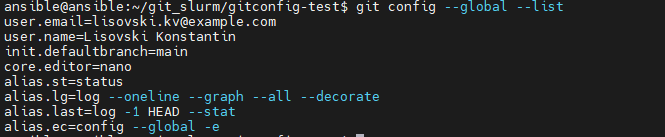
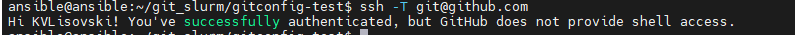
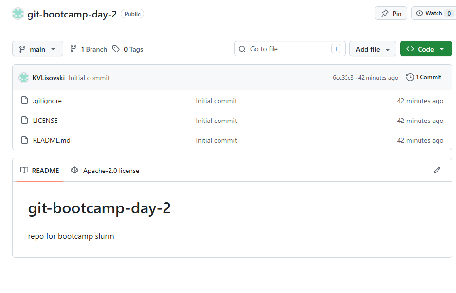
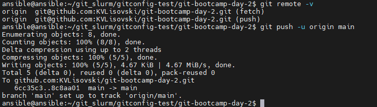
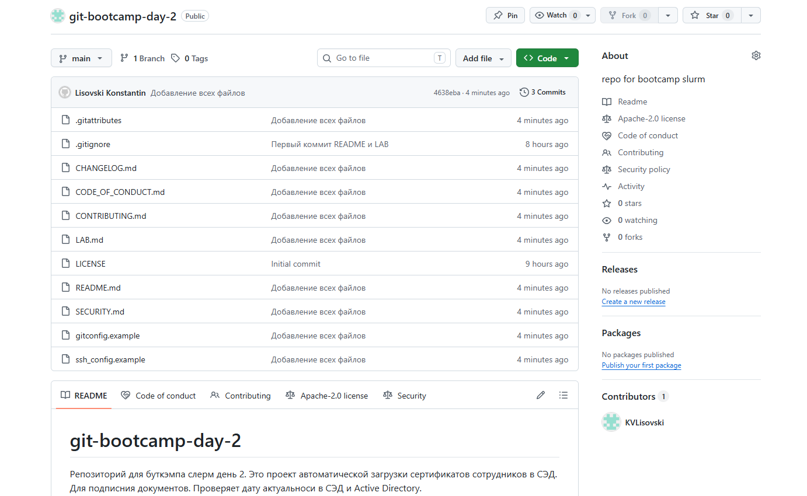

# LAB — день 2

Отчёт о выполнении домашнего задания дня 2 в рамках курса ["Интенсив по погружению в GIT"](https://slurm.io/git-intensive): настройка `gitconfig` и SSH, создание публичного репозитория, наполнение его служебными и стандартными файлами.

## Содержание

- [LAB — день 2](#lab--день-2)
  - [Содержание](#содержание)
  - [Настройка gitconfig](#настройка-gitconfig)
  - [SSH-ключ и подключение к GitHub](#ssh-ключ-и-подключение-к-github)
  - [Создание репозитория](#создание-репозитория)
  - [Служебные файлы](#служебные-файлы)
    - [`.gitignore`](#gitignore)
    - [`.gitattributes`](#gitattributes)
  - [Стандартные файлы и выбор лицензии](#стандартные-файлы-и-выбор-лицензии)
    - [Почему именно эта лицензия](#почему-именно-эта-лицензия)
  - [Markdown](#markdown)
  - [Финальный пуш](#финальный-пуш)

## Настройка gitconfig

Выполнены настройки пользователя и его контактных данных, коммиты будут подписаны им. Заданы как глобальные настройки так и локальные данные для подключения к рабочему и личному репозиторию.
Созданы полпклярные псевдонимы:
 st = status (посмотреть статус)
 lg = log --oneline --graph --all --decorate (красивый просмотр)
 last = log -1 HEAD --stat (инфо по последнему коммиту)
 ec = config --global -e (быстро редактировать глобальные настройки)


Скриншот вывода `git config --global --list`:



Полный фрагмент моего конфига — в файле [`gitconfig.example`](gitconfig.example).

## SSH-ключ и подключение к GitHub

Использовался алгоритм шифрования ed25519 как наиболее современный, в ~/.ssh/config лежат настройки к Github и какой ключ использовать для него. Парольная фраза использована.


Скриншот ответа GitHub на `ssh -T git@github.com`:



Фрагмент моего `~/.ssh/config` — в файле [`ssh_config.example`](ssh_config.example).

## Создание репозитория

Да, выбрана видимость public, лицензия и readme созданы через интерфейс github.


Скриншот свежесозданного репозитория:



## Служебные файлы

### `.gitignore`

Стек: `java`. Выбрал, потому что на работе работаем с ней.

За основу взял шаблон с `https://www.toptal.com/developers/gitignore/api/java` и добавил правила из лекции.

### `.gitattributes`

Минимум — `* text=auto` для нормализации переносов строк между macOS/Linux и Windows. Дополнительные правила:
Вставлено правило: для Markdown-файлов используется специальный инструмент сравнения 
```text
*.md diff=markdown
```

## Стандартные файлы и выбор лицензии

В корне лежат:
## Чек-листы


- [x] выполнено
- [ ] в работе
- [ ] не начато


- [x] [`README.md`](README.md) — визитка проекта.
- [x] [`CHANGELOG.md`](CHANGELOG.md) — формат Keep a Changelog.
- [x] [`LICENSE`](LICENSE) — выбранная лицензия.
- [x] [`CONTRIBUTING.md`](CONTRIBUTING.md) — как контрибьютить.
- [x] [`CODE_OF_CONDUCT.md`](CODE_OF_CONDUCT.md) — Contributor Covenant.
- [x] [`SECURITY.md`](SECURITY.md) — политика раскрытия уязвимостей.

### Почему именно эта лицензия

Плюсы лицензии Apache 2.0:
- Гибкость и свобода использования;
- Защита интеллектуальной собственности;
- Совместимость с другими лицензиями;
- Защита от патентных претензий;
- Не требует раскрытия исходного кода производных проектов.

## Markdown
Файл и LAB.md и README.md содеражат основные элементы.

В этом отчёте и в `README.md` использованы:

- заголовки `H1`/`H2`/`H3`;
- оглавление в начале со ссылками на якоря;
- блоки кода с подсветкой (`bash`, `text`);
- сворачиваемый блок (см. ниже);
- ссылки на внешние URL.

<details>
<summary>Пример сворачиваемого блока</summary>

- Здесь должно быть что то полезное
Полезно? 
- [ ] Да
- [ ] Нет

</details>

## Финальный пуш

git push -u origin main буквально читается так: Отправь мою текущую локальную ветку в удалённый репозиторий origin в ветку main, и запомни эту связь на будущее. Ничего не справшивал про публичность.

Терминал с пушем:



Главная страница репозитория после пуша:



